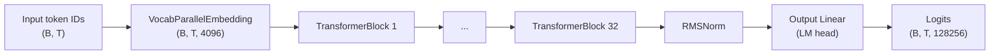
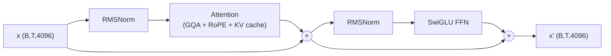
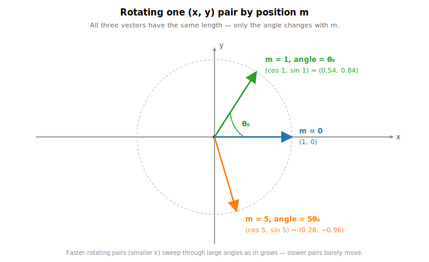
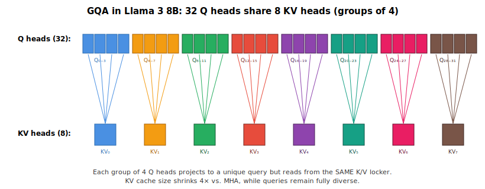
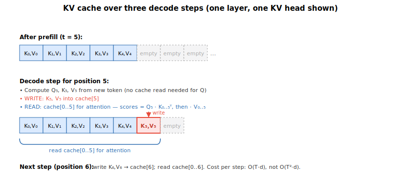

# Llama 3 — A Study Guide

## 1. TL;DR (zoom-out, 1 paragraph)

Llama 3 is Meta's 2024 open-weights large language model — a **decoder-only transformer** that reads a sequence of text tokens and predicts the next token, one at a time. It comes in 8B and 70B parameter sizes and has a context window of 8,192 tokens. Architecturally it is the same family as GPT and Llama 2: stacked transformer blocks, each with self-attention and a feed-forward network. What makes it notable is not a new architectural idea but a collection of well-tuned "modernizations" over the 2017 Transformer: **RMSNorm** instead of LayerNorm (cheaper, no bias), **RoPE** instead of learned positional embeddings (better at extrapolating to longer sequences), **SwiGLU** instead of ReLU MLPs (better quality per FLOP), and **Grouped-Query Attention (GQA)** so the key/value cache stays small during inference. Compared to Llama 2 the architecture is almost identical — the real jumps are a 4× bigger vocabulary (128K, tiktoken-based), a 2× longer context (8K vs 4K), a much larger RoPE base frequency (500,000 vs 10,000) so long contexts don't alias, and dramatically more training data (~15T tokens).

### The whole architecture, in one picture

<figure markdown>
  { width="480" }
  <figcaption>Llama 3 8B, paper-style. Block 1 is drawn out; blocks 2–32 are identical. Tensor shapes annotated on the wires.</figcaption>
</figure>

---

## 2. The 30-second mental model




Inside **each TransformerBlock** (pre-norm residual structure):




That diagram is the whole model. The rest of the notes expand every box.

---

## 3. Key hyperparameters (with intuition)

These are the defaults in [llama/model.py:20-32](https://github.com/meta-llama/llama3/blob/main/llama/model.py#L20-L32) overlaid with the **real** 8B parameters which the inference code pulls from `params.json` on disk.


| Param                | Value (8B) | What it means                                                                                                                    | Why this value                                                                                    |
| -------------------- | ---------- | -------------------------------------------------------------------------------------------------------------------------------- | ------------------------------------------------------------------------------------------------- |
| `dim`                | 4096       | Width of the residual stream — every token is represented as a 4096-dim vector that gets read from and written to by each block. | Wider ⇒ more capacity per token. 4096 is the standard "medium" width.                             |
| `n_layers`           | 32         | Depth: how many transformer blocks are stacked. Depth gives the model its reasoning hops.                                        | Deeper ⇒ more serial compute / more reasoning depth. 32 is the Llama-8B-class standard.           |
| `n_heads`            | 32         | Number of query attention heads.                                                                                                 | `head_dim = dim / n_heads = 128`. 128 is a sweet spot for GPU tensor cores.                       |
| `n_kv_heads`         | 8          | Number of **shared** key/value heads (GQA). 32 query heads are split into 8 groups of 4, each group sharing one K and one V.     | Shrinks the KV cache by 4× at inference for nearly-free quality loss.                             |
| `vocab_size`         | 128,256    | Size of the token vocabulary. See §4.1 for what "128K" really means.                                                             | 4× bigger than Llama 2's 32K — ~15% fewer tokens for the same text.                               |
| `multiple_of`        | 1024       | Rounds the FFN hidden dim to a multiple of this for hardware-friendly shapes.                                                    | Bigger multiples ⇒ nicer tensor cores; cost is a slightly bigger FFN.                             |
| `ffn_dim_multiplier` | 1.3        | Extra scale factor on the FFN hidden dim.                                                                                        | Pushes FFN hidden dim to ≈ `3.47·dim`, which Llama 3 found better.                                |
| `norm_eps`           | 1e-5       | Stability epsilon inside RMSNorm.                                                                                                | Prevents division-by-zero when activations are near zero.                                         |
| `rope_theta`         | 500,000    | Base frequency for Rotary Position Embeddings.                                                                                   | Llama 2 used 10,000. Bigger base ⇒ slower-rotating sinusoids ⇒ better support for long positions. |
| `max_batch_size`     | 32         | Pre-allocates the KV cache of this batch size.                                                                                   | Static cache sizing — trades memory for avoiding reallocations.                                   |
| `max_seq_len`        | up to 8192 | Max context length. Asserted in `Llama.build`.                                                                                   | Defines cache length and RoPE table length.                                                       |


---

## 4. Architecture walk-through (zoom-in)

### 4.1 Tokenizer & embeddings

**What it is.** A function `text → list[int]`, plus a lookup table `int → vector`.

**Why it exists.** Neural nets only eat numbers. We need a reversible way to chop text into integer IDs, and a trainable table that turns each ID into a 4096-dim vector ("word embedding").

#### 🤔 "Vocab size is 128,256 — aren't there way more words than that?"

This is the right question to ask, and the answer is: **tokens are not words**.

Tokens are **sub-word pieces** learned by an algorithm called **BPE (Byte Pair Encoding)**. BPE starts from raw bytes (256 of them) and iteratively merges the most frequent adjacent pair into a new token. Common whole words become single tokens; rare words get split into a handful of pieces; completely novel strings fall back to individual bytes. So 128,256 tokens can represent **any** UTF-8 text, including languages and emojis the tokenizer has never seen — they just take more tokens.

Concretely (using the Llama 3 tokenizer):


| Text                              | Tokens (approx.)                                        | # tokens |
| --------------------------------- | ------------------------------------------------------- | -------- |
| `" cat"`                          | `[" cat"]`                                              | 1        |
| `" hippopotamus"`                 | `[" hippo", "pot", "amus"]`                             | 3        |
| `" antidisestablishmentarianism"` | `[" anti", "dis", "establish", "ment", "arian", "ism"]` | 6        |
| `" 你好"` (Chinese "hello")         | multi-byte fallback tokens                              | 2–3      |
| `" 🚀"`                           | 4 byte-level tokens                                     | 4        |


**Analogy.** English has millions of possible word forms, but only 26 letters. BPE is somewhere between those two extremes — a vocabulary of "word fragments" you can compose to write anything. 128K is large enough that the ~20,000 most common English words tend to be single tokens, while rare/technical/multi-lingual strings get decomposed.

**Why 128K and not 50K or 500K?** Bigger vocab → shorter token sequences → less compute per sentence → effectively longer context. But also → a bigger embedding table (128K × 4096 = ~525M params just for embeddings) and a bigger LM head. Llama 3 picked 128K as the sweet spot. Llama 2 used 32K. GPT-4 uses ~100K.

#### The regex and special tokens

```python
# llama/tokenizer.py:47 — the regex that defines "raw chunks" before BPE merging.
# Breaks text into contractions, words, short number runs, punctuation, whitespace.
pat_str = r"(?i:'s|'t|'re|'ve|'m|'ll|'d)|[^\r\n\p{L}\p{N}]?\p{L}+|\p{N}{1,3}| ?[^\s\p{L}\p{N}]+[\r\n]*|\s*[\r\n]+|\s+(?!\S)|\s+"

# Special tokens occupy the top 256 slots of the vocab:
special_tokens = [
    "<|begin_of_text|>",     # BOS: start of any input
    "<|end_of_text|>",       # EOS: end of raw-text completion
    "<|start_header_id|>",   # Wraps the role marker in chat format
    "<|end_header_id|>",
    "<|eot_id|>",            # "End of turn" — separates chat messages
    # ... + ~250 reserved slots for future use
]
```

#### The embedding lookup

[llama/model.py:280](https://github.com/meta-llama/llama3/blob/main/llama/model.py#L280):

```python
h = self.tok_embeddings(tokens)   # tokens: (B, T) int   →   h: (B, T, 4096)
```

`VocabParallelEmbedding` is a big lookup matrix of shape `(128256, 4096)`, sharded across GPUs — functionally identical to `nn.Embedding`. **Each row is a 4096-dim vector, and there are 128,256 rows.** Token ID *i* just grabs row *i*.

Positions are **not** encoded here. They're injected later by RoPE, inside attention.

---

### 4.2 Positional encoding: Rotary Position Embeddings (RoPE)

**What it is.** A way to inject token position information by **rotating** query and key vectors in 2D subspaces.

**Why it exists.** Self-attention is permutation-invariant — without position info, "dog bites man" and "man bites dog" are identical. RoPE encodes position so that (a) no extra parameters are added, (b) attention naturally encodes **relative** position (similarity between positions *i* and *j* depends only on `i − j`), (c) it extrapolates well to longer contexts than seen during training.

#### The math

Take one query vector **q** (a d-dim vector) at position **m**. Group its d dimensions into d/2 pairs: (q₀, q₁), (q₂, q₃), …. Each pair is treated as a 2D vector and **rotated** by an angle that depends on both the position m and which pair we're rotating.

For pair k (indices 2k and 2k+1), the rotation angle is m·θₖ, where:

```
θₖ = θ_base ^ (−2k/d),     for k = 0, 1, …, d/2 − 1
```

In Llama 3, θ_base = 500,000 and d = 128 (head_dim), so θ₀ = 1 (fastest rotation) down to θ₆₃ ≈ 1/500,000 (slowest).

The 2D rotation for pair k at position m:

```
⎛ q'₂ₖ   ⎞   ⎛ cos(m·θₖ)   −sin(m·θₖ) ⎞ ⎛ q₂ₖ   ⎞
⎜        ⎟ = ⎜                        ⎟ ⎜       ⎟
⎝ q'₂ₖ₊₁ ⎠   ⎝ sin(m·θₖ)    cos(m·θₖ) ⎠ ⎝ q₂ₖ₊₁ ⎠
```

The key property that makes RoPE work:

```
⟨ R_m · q ,  R_n · k ⟩   =   ⟨ q ,  R_(n−m) · k ⟩
```

Translation: the dot product between a rotated query at position m and a rotated key at position n depends **only on the difference n − m** — not on their absolute positions. That's what "relative position" means here.

#### Visual: rotating one pair



The vector's **length never changes** — rotation only moves it around the unit circle. What changes is its *angle*, and that angle encodes position.

#### Worked numerical example

Let's use a tiny head_dim d = 4 (just 2 pairs) and θ_base = 10,000 for readability.

Frequencies:

```
θ₀ = 10000^(−0/4) = 1
θ₁ = 10000^(−2/4) = 10000^(−0.5) = 0.01
```

Take a query vector q = [1, 0, 1, 0]. Let's rotate it at **position m = 2**:

- **Pair 0** (q₀, q₁) = (1, 0). Angle = 2 · 1 = 2 rad.  
New pair = (cos 2, sin 2) = (−0.416, 0.909).
- **Pair 1** (q₂, q₃) = (1, 0). Angle = 2 · 0.01 = 0.02 rad.  
New pair = (cos 0.02, sin 0.02) = (0.9998, 0.020).

So R₂·q ≈ [−0.416, 0.909, 0.9998, 0.020].

At **position m = 5** the same q becomes:

- Pair 0: angle = 5 rad → (cos 5, sin 5) = (0.284, −0.959)
- Pair 1: angle = 0.05 rad → (0.9988, 0.050)

So R₅·q ≈ [0.284, −0.959, 0.9988, 0.050].

Notice:

1. The **low-frequency pair** (pair 1, small θ₁) barely moves — it barely changes between positions 2 and 5. It tracks "far-scale" position.
2. The **high-frequency pair** (pair 0, θ₀ = 1) whipped almost halfway around the circle. It tracks "near-scale" position.
3. Different pairs = different clock hands at different speeds. Together they give a unique "position fingerprint" for each m.

Now the punchline. Say a key k = [1, 0, 1, 0] sits at position n = 3 (so n − m = 3 − 2 = 1). You can verify by computing the dot product ⟨R₂·q, R₃·k⟩ that it equals ⟨q, R₁·k⟩ — attention only cares about **relative offset**, not absolute indices.

> ⚠️ **Confusion point:** RoPE is applied only to **Q and K**, never to V. The point is to make ⟨qᵢ, kⱼ⟩ encode i − j. Values don't participate in the positional inner product, so rotating them would just add noise.

#### Why is this better than the original (2017) position encoding?

The 2017 Transformer used **sinusoidal absolute** position encoding: a fixed (non-learned) vector per position, *added* to the token embedding at the input layer. GPT-2 used learned absolute embeddings — same idea, but the position vectors are trainable. RoPE beats both on four axes:

**1. Relative by construction, not by accident.** Sinusoidal gives the model two *absolute* positions (pos_i and pos_j) and trusts attention to figure out "distance = j − i" on its own. RoPE bakes relative position in by identity:

```
⟨ R_m · q ,  R_n · k ⟩   =   ⟨ q ,  R_(n−m) · k ⟩
```

Attention only ever looks at relative offsets, which is what it actually cares about — "how far back is that token?" is almost always more useful than "what's my absolute index?"

**2. Injected at every layer, not just the first.** Sinusoidal/learned-absolute is added *once* at the input embedding. After 32 blocks of residual adds, norms, and SwiGLU nonlinearities, that position signal gets progressively blurred — late layers are working with a mushy echo of it. RoPE is applied *inside attention* every single layer, so position info is fresh each time Q meets K.

**3. Doesn't contaminate values.** Sinusoidal mixes position into the entire residual stream, so values V carry a position signal mixed in with their content. RoPE only rotates Q and K. Values stay pure *content* — the thing that actually gets passed along stays uncoupled from "where it came from."

**4. Extrapolates to longer contexts.** Sinusoidal's theoretical extrapolation to unseen positions is mediocre in practice; learned absolute embeddings don't extrapolate *at all* (position 8193 has literally no vector). RoPE degrades gracefully past training length, and with cheap tweaks — like Llama 3's jump from θ_base = 10,000 to 500,000, or tricks like YaRN and NTK-aware scaling — context can be extended far beyond the training window with little or no retraining.

**One-sentence version:** sinusoidal says "here is *where* you are"; RoPE says "here is *how far apart* you and this other token are" — which is the actual question attention is asking.

#### The code

```python
# llama/model.py:49-54 — precompute complex exponentials once.
def precompute_freqs_cis(dim: int, end: int, theta: float = 10000.0):
    # freqs[k] = 1 / theta^(2k/dim)  for k = 0, 2, ..., dim-2
    freqs = 1.0 / (theta ** (torch.arange(0, dim, 2)[: (dim // 2)].float() / dim))
    t = torch.arange(end, device=freqs.device, dtype=torch.float32)   # positions 0..end-1
    freqs = torch.outer(t, freqs)                        # (end, dim/2) — angle per (pos, pair)
    # torch.polar(1, angle) = e^(i·angle) — a pure rotation on the unit circle.
    freqs_cis = torch.polar(torch.ones_like(freqs), freqs)   # complex64, (end, dim/2)
    return freqs_cis

# llama/model.py:65-75 — apply rotation to q and k.
def apply_rotary_emb(xq, xk, freqs_cis):
    # Reinterpret the last dim as pairs: (..., d) → (..., d/2, 2) → view as complex.
    xq_ = torch.view_as_complex(xq.float().reshape(*xq.shape[:-1], -1, 2))
    xk_ = torch.view_as_complex(xk.float().reshape(*xk.shape[:-1], -1, 2))
    freqs_cis = reshape_for_broadcast(freqs_cis, xq_)
    # Complex multiply = rotate each pair by its position-dependent angle.
    xq_out = torch.view_as_real(xq_ * freqs_cis).flatten(3)
    xk_out = torch.view_as_real(xk_ * freqs_cis).flatten(3)
    return xq_out.type_as(xq), xk_out.type_as(xk)
```

The trick is representing each pair as a complex number x + iy, then using complex multiplication — because (x + iy) · e^(iφ) is literally the rotation of (x, y) by angle φ. Elegant.

---

### 4.3 Normalization: RMSNorm

**What it is.** A simpler, cheaper variant of LayerNorm.

**Why it exists.** LayerNorm subtracts the mean, divides by std, and has a learnable bias. Empirically, the mean-subtraction and bias add little; removing them makes the op ~20% faster and doesn't hurt quality.

**The math:**

```
                     x
RMSNorm(x)  =  ────────────────────────  ⊙  γ
                √( (1/d) Σᵢ xᵢ²  +  ε )
```

Compare with LayerNorm:

```
                    x − μ
LayerNorm(x)  =  ─────────────  ⊙  γ  +  β
                  √(σ² + ε)

     where   μ  = (1/d) Σᵢ xᵢ
             σ² = (1/d) Σᵢ (xᵢ − μ)²
```

RMSNorm drops μ (the mean subtraction) and β (the bias). That's the whole difference.

```python
# llama/model.py:35-46
class RMSNorm(torch.nn.Module):
    def __init__(self, dim: int, eps: float = 1e-6):
        super().__init__()
        self.eps = eps
        self.weight = nn.Parameter(torch.ones(dim))   # learnable per-dim scale γ

    def _norm(self, x):
        # rsqrt(mean(x²) + ε)  — reciprocal of RMS. No mean subtraction.
        return x * torch.rsqrt(x.pow(2).mean(-1, keepdim=True) + self.eps)

    def forward(self, x):
        # Upcast to fp32 for numerical stability of the squaring, then back.
        output = self._norm(x.float()).type_as(x)
        return output * self.weight
```

**Pre-norm vs post-norm.** Llama 3 is **pre-norm**: the norm is applied to the *input* of each sublayer, not to the residual sum. See [llama/model.py:246-247](https://github.com/meta-llama/llama3/blob/main/llama/model.py#L246-L247):

```python
h   = x + self.attention(self.attention_norm(x), ...)   # normed input → attn → residual add
out = h + self.feed_forward(self.ffn_norm(h))           # normed input → ffn → residual add
```

Pre-norm trains more stably at depth — the residual "highway" is never touched by norms, so gradients flow cleanly end-to-end.

---

### 4.4 Attention: Grouped-Query Attention (GQA) with KV cache

**What it is.** The mechanism by which each token mixes information from previous tokens.

**Why it exists.** Each token produces three vectors: a **query** (what am I looking for?), a **key** (what do I offer?), and a **value** (what should be passed along if matched?). The attention output is a weighted average of values, where weights come from query-key similarity.

#### The math

Standard scaled dot-product attention:

```
                               ⎛  Q · Kᵀ  ⎞
Attention(Q, K, V)  =  softmax ⎜ ──────── ⎟ · V
                               ⎝   √dₖ    ⎠
```

Where Q ∈ ℝ^(T × dₖ), K ∈ ℝ^(T × dₖ), V ∈ ℝ^(T × d_v). The √dₖ division keeps the softmax from saturating when dₖ is large (variance of a dot product of dₖ iid terms grows with dₖ).

For multi-head, this is repeated h times in parallel with different projections, then concatenated. In GQA, the **queries** still have h heads, but the **keys and values** have h_kv < h heads, and each KV head is shared across a group of h / h_kv query heads.

#### Why does GQA work? Doesn't it lose detail?

Good instinct to worry — at first glance, 4 query heads looking at 1 shared key/value locker *should* be worse than 4 private lockers. The reason it isn't, in practice:

1. **In vanilla MHA, many heads learn redundant K/V patterns.** The GQA paper (Ainslie et al., 2023) showed that when you look at what each K and V head actually learns across a trained transformer, there's substantial duplication. You're paying to store nearly-identical information four times.
2. **Queries carry the diversity, keys/values carry the content.** The 4 queries in a group still ask 4 *different* questions. They just reference the same evidence. Think: 4 students reading the same textbook but with different homework prompts. They extract different answers because their questions differ.
3. **Empirically small quality drop.** Going from MHA → GQA-8 (32 Q, 8 KV) on Llama-sized models costs ~0.1–0.3 perplexity points. Going further to MQA (32 Q, 1 KV) costs ~1 ppl — that's the knee. GQA sits at the knee.
4. **The savings are huge.** The KV cache is **the dominant memory cost** of long-context inference. 4× reduction = 4× longer contexts, or 4× bigger batches, at (roughly) the same quality.

#### GQA structure, visualized



#### The KV cache — how and why

**The problem it solves.** During autoregressive generation, the model produces one token at a time. Naively, at step t the model runs a full forward pass on tokens [0, 1, …, t]. But the Q/K/V projections for tokens 0 through t−1 were **already computed in the previous step** — they are deterministic functions of those input tokens. Recomputing them is waste.

**The insight.** Store Kⱼ and Vⱼ for all past tokens. At step t, compute only Qₜ, Kₜ, Vₜ for the newest token, append Kₜ and Vₜ to the cache, and do attention between Qₜ and the full cached K[0..t], V[0..t].

**What's NOT cached: queries.** Q at step t is only used once — for computing attention scores at step t — and then discarded. Storing it would just waste memory. (The one exception is the prefill pass, where we compute many tokens at once; their Qs are used once then discarded.)

**Cache size** for Llama 3 8B at max context, in bf16:

```
cache_bytes  =  2  ×  n_layers  ×  n_kv_heads  ×  d_head  ×  T  ×  bytes_per_elem
             =  2  ×    32      ×      8       ×   128    × 8192 ×       2
             ≈  1.07 GB per sequence
```

With MHA (n_kv = 32) that would have been ~4.3 GB. This is the concrete, operational win of GQA.

#### Visual: cache evolution across three timesteps



#### Constructor

```python
# llama/model.py:90-144 — Attention constructor (abbreviated)
class Attention(nn.Module):
    def __init__(self, args):
        super().__init__()
        self.n_kv_heads = args.n_kv_heads or args.n_heads   # 8 for Llama 3 8B
        self.n_local_heads    = args.n_heads    // mp_size  # 32 Q heads
        self.n_local_kv_heads = self.n_kv_heads // mp_size  # 8  KV heads
        self.n_rep = self.n_local_heads // self.n_local_kv_heads   # 4
        self.head_dim = args.dim // args.n_heads                   # 128

        self.wq = ColumnParallelLinear(args.dim, args.n_heads * self.head_dim, bias=False, ...)
        self.wk = ColumnParallelLinear(args.dim, self.n_kv_heads * self.head_dim, bias=False, ...)
        self.wv = ColumnParallelLinear(args.dim, self.n_kv_heads * self.head_dim, bias=False, ...)
        self.wo = RowParallelLinear(args.n_heads * self.head_dim, args.dim, bias=False, ...)

        # Pre-allocated static KV cache. Shape: (max_batch, max_seqlen, n_kv_heads, head_dim)
        self.cache_k = torch.zeros((args.max_batch_size, args.max_seq_len,
                                    self.n_local_kv_heads, self.head_dim)).cuda()
        self.cache_v = torch.zeros_like(self.cache_k)
```

#### Forward

```python
# llama/model.py:146-190
def forward(self, x, start_pos, freqs_cis, mask):
    bsz, seqlen, _ = x.shape                  # x: (B, T_new, 4096) — T_new=1 when decoding
    xq, xk, xv = self.wq(x), self.wk(x), self.wv(x)
    xq = xq.view(bsz, seqlen, self.n_local_heads,    self.head_dim)   # (B, T_new, 32, 128)
    xk = xk.view(bsz, seqlen, self.n_local_kv_heads, self.head_dim)   # (B, T_new,  8, 128)
    xv = xv.view(bsz, seqlen, self.n_local_kv_heads, self.head_dim)   # (B, T_new,  8, 128)
    xq, xk = apply_rotary_emb(xq, xk, freqs_cis=freqs_cis)             # RoPE on Q and K only

    # WRITE: store new K/V into the cache at positions [start_pos, start_pos+seqlen)
    self.cache_k[:bsz, start_pos : start_pos + seqlen] = xk
    self.cache_v[:bsz, start_pos : start_pos + seqlen] = xv

    # READ: everything from position 0 through the end of the new tokens
    keys   = self.cache_k[:bsz, : start_pos + seqlen]   # (B, T_total, 8, 128)
    values = self.cache_v[:bsz, : start_pos + seqlen]

    # GQA expansion: copy each of 8 KV heads 4 times → 32 heads to align with Q.
    # Pure memory view, no new computation.
    keys   = repeat_kv(keys,   self.n_rep)   # (B, T_total, 32, 128)
    values = repeat_kv(values, self.n_rep)

    # Standard attention from here on.
    xq    = xq.transpose(1, 2)                # (B, 32, T_new,   128)
    keys  = keys.transpose(1, 2)              # (B, 32, T_total, 128)
    values= values.transpose(1, 2)
    scores = torch.matmul(xq, keys.transpose(2, 3)) / math.sqrt(self.head_dim)
    if mask is not None: scores = scores + mask
    scores = F.softmax(scores.float(), dim=-1).type_as(xq)
    output = torch.matmul(scores, values)
    output = output.transpose(1, 2).contiguous().view(bsz, seqlen, -1)
    return self.wo(output)
```

---

### 4.5 Feed-forward network: SwiGLU

**What it is.** A two-layer MLP with a gating mechanism.

**Why it exists.** The classic transformer FFN is `Linear → ReLU → Linear` — a simple per-token nonlinearity that lets tokens do point-wise computation after mixing via attention. SwiGLU replaces this with a gated variant that empirically gives better loss per parameter.

#### The math

```
                              x
SiLU(x)  =  x · σ(x)  =  ─────────────
                          1 + e^(−x)
```

```
SwiGLU(x)  =  W₂ · (  SiLU(W₁·x)   ⊙   (W₃·x)  )
              └down┘  └── gate ──┘       └ up ┘
```

Three learnable projections, not two: W₁ (the "gate" projection, goes through SiLU), W₃ (the "up" projection, no activation), and W₂ (the "down" projection, back to model dim). The SwiGLU operator is the elementwise product of the first two.

#### Range and extreme scenarios (a deeper look at SiLU)


Three things to read off the plot:

- **Linear on the right**, so for large positive x, SiLU behaves like the identity (compare with the dashed `y = x`).
- **Not bounded below at 0 like ReLU.** SiLU dips slightly negative, with a global minimum at roughly `(−1.28, −0.278)` marked in red. This is the "negative gate" that SwiGLU can exploit.
- **Smoothly approaches 0 on the left**, slowly — at `x = −10`, SiLU is still about `−4.5 × 10⁻⁴`. Not zero, just vanishingly small. Crucially, no kink at `x = 0` (unlike ReLU), which helps gradient flow during optimization.

**SwiGLU range.** SiLU(W₁·x) ⊙ (W₃·x) is **unbounded in both directions** and not monotonic. Think of W₁·x as the "soft gate" (call it a) and W₃·x as the "signal" (call it b):


| Gate value a = W₁·x      | SiLU(a) behavior | Net effect on output channel                                              |
| ------------------------ | ---------------- | ------------------------------------------------------------------------- |
| a ≫ 0 (large positive)   | SiLU ≈ a         | Gate wide open, output ≈ a · b — grows as product                         |
| a ≈ 0                    | SiLU ≈ 0         | Gate nearly closed, output ≈ 0                                            |
| a ≈ −1.28 (SiLU minimum) | SiLU ≈ −0.28     | Small NEGATIVE gate — unusual, sign-flips the signal with small magnitude |
| a ≪ 0 (large negative)   | SiLU → 0         | Gate closed, output ≈ 0                                                   |


**Extreme scenario 1 — everything gates off.** If every W₁·x coordinate is deeply negative for some token, SiLU pushes them all toward zero, SwiGLU output ≈ 0, and the FFN is effectively a no-op for that token. It passes through via the residual connection only.

**Extreme scenario 2 — everything gates fully open.** If W₁·x and W₃·x are both huge positive, SwiGLU output ≈ (W₁·x) ⊙ (W₃·x) — which grows **quadratically** in input magnitude. This is why the preceding RMSNorm matters: it keeps input magnitudes bounded so SwiGLU doesn't blow up. In bf16, unchecked growth here would overflow.

**Extreme scenario 3 — the "negative gate" quirk.** Unlike ReLU-based gates, SwiGLU's gate can be mildly negative. This means SwiGLU can actively *invert* a signal channel, not just pass or block it. Whether this extra expressivity is "useful" or "cute" is debated; empirically it doesn't hurt, and it makes the function smooth, which helps optimization.

#### The code

```python
# llama/model.py:193-219
class FeedForward(nn.Module):
    def __init__(self, dim, hidden_dim, multiple_of, ffn_dim_multiplier):
        super().__init__()
        # Vanilla transformer would use hidden = 4·dim. SwiGLU has two parallel up-projections,
        # so we shrink hidden by 2/3 to keep the total parameter budget the same.
        hidden_dim = int(2 * hidden_dim / 3)
        if ffn_dim_multiplier is not None:
            hidden_dim = int(ffn_dim_multiplier * hidden_dim)   # Llama 3: ×1.3
        hidden_dim = multiple_of * ((hidden_dim + multiple_of - 1) // multiple_of)

        self.w1 = ColumnParallelLinear(dim, hidden_dim, bias=False, ...)   # gate projection
        self.w2 = RowParallelLinear(hidden_dim, dim, bias=False, ...)      # down projection
        self.w3 = ColumnParallelLinear(dim, hidden_dim, bias=False, ...)   # up projection

    def forward(self, x):
        # SwiGLU: elementwise product of (SiLU-activated gate) and (up projection).
        return self.w2(F.silu(self.w1(x)) * self.w3(x))
        #        └── down ──┘ └── gate ──┘   └── up ──┘
```

Shapes: `x: (B, T, 4096)` → `w1(x), w3(x): (B, T, 14336)` → elementwise product: `(B, T, 14336)` → `w2(·): (B, T, 4096)`.

---

### 4.6 The TransformerBlock

Attention + FFN together, with pre-norm residuals:

```python
# llama/model.py:239-248
def forward(self, x, start_pos, freqs_cis, mask):
    # Attention sub-block: norm → attention → add to residual.
    h = x + self.attention(self.attention_norm(x), start_pos, freqs_cis, mask)
    # FFN sub-block: norm → swiglu → add to residual.
    out = h + self.feed_forward(self.ffn_norm(h))
    return out
```

Two sublayers, two residual adds, two RMSNorms. This block is repeated 32 times for Llama 3 8B.

### 4.7 LM head

**What it is.** A final projection from the 4096-dim residual stream onto the 128,256-dim vocabulary logit space.

```python
# llama/model.py:266-269
self.norm   = RMSNorm(params.dim, eps=params.norm_eps)
self.output = ColumnParallelLinear(params.dim, params.vocab_size, bias=False, ...)
```

> ⚠️ **No weight tying.** Some transformers share weights between the token embedding and the output projection. Llama 3 does **not** — `tok_embeddings` and `output` are two separate tensors. Costs ~525M extra parameters but removes a constraint that can hurt quality on large vocabularies.

### 4.8 The causal mask

Because Llama 3 is a decoder-only autoregressive model, position *i* must not peek at positions > i. The mask is built in `Transformer.forward` and added to attention scores before softmax:

```python
# llama/model.py:284-296
mask = None
if seqlen > 1:   # no mask needed when decoding a single token
    mask = torch.full((seqlen, seqlen), float("-inf"), device=tokens.device)
    mask = torch.triu(mask, diagonal=1)    # -inf above the diagonal, 0 on/below
    # With KV cache, new tokens can see ALL cached tokens; prepend `start_pos` zero columns.
    mask = torch.hstack(
        [torch.zeros((seqlen, start_pos), device=tokens.device), mask]
    ).type_as(h)
```

---

## 5. A concrete forward pass: feeding "The cat sat on" into the model

The previous section explained the components. This one takes a real, small sentence and traces what happens to its vectors, step by step. Tokens, shapes, and semantic descriptions — everything grounded.

**Input:** `"The cat sat on"` (an incomplete sentence; we want the model to predict what comes next).

### Step 1 — Tokenize

Using the Llama 3 tiktoken BPE (approximate IDs; exact values vary):

```
"The cat sat on"
  ↓  BOS is always prepended.
[<|begin_of_text|>, "The", " cat", " sat", " on"]
[    128000      ,  791 ,  8415 ,  7731 ,  389 ]
```

Sequence length T = 5. Shape so far: `(1, 5)` — one batch, five token IDs.

### Step 2 — Embed

`h = tok_embeddings(tokens)` → shape `(1, 5, 4096)`.

Each ID indexes one row of a (128256, 4096) lookup table. At this point, the vector for " cat" is a **generic, context-free "cat" vector** — it looks the same regardless of whether the sentence is about a pet, a costume, or the Unix command.

### Step 3 — The journey through 32 blocks (illustrated)

At each block, every token's 4096-dim vector gets (a) updated with information about *other* tokens in the sentence via attention, and (b) refined by a per-token FFN. Here's a schematic of how the **contextual content** of each token's vector evolves across key layers:


*The colored boxes are the same 5 token positions. The content written in each row is a cartoon of "what semantic content the vector at that layer encodes." Shapes never change — always* `(1, 5, 4096)`*.*

**What's happening underneath (one block):**


| Stage                          | On " cat" (position 2)                                                                                  | Shape                                       |
| ------------------------------ | ------------------------------------------------------------------------------------------------------- | ------------------------------------------- |
| `attention_norm`               | Rescale vector to unit RMS                                                                              | `(1, 5, 4096)`                              |
| `wq, wk, wv`                   | Project into 32 Q heads, 8 K heads, 8 V heads                                                           | Q: `(1, 5, 32, 128)`, K/V: `(1, 5, 8, 128)` |
| RoPE on Q, K                   | Rotate pair-by-pair using angles for position 2                                                         | same shapes                                 |
| Cache write                    | `cache_k[0, 2] = xk[:, 2]`; same for V                                                                  | —                                           |
| Attention                      | "cat" (pos 2) can only see positions 0-2 (causal mask) → attention scores highest on BOS, "The", itself | `scores: (1, 32, 5, 5)`                     |
| `wo` + residual                | Project back to 4096, add to input                                                                      | `(1, 5, 4096)`                              |
| `ffn_norm` + SwiGLU + residual | Per-token nonlinear refinement                                                                          | `(1, 5, 4096)`                              |


Repeat 32 times. Each time, more context gets mixed in, and more abstract features get built. By the last layers, each token's vector is mostly about "what token do I predict comes next after me?"

### Step 4 — Final norm + LM head

Take the final hidden state for the LAST token (" on" at position 4):

```python
h_last = h[:, -1, :]          # (1, 4096) — the " on" token's final vector
h_last = self.norm(h_last)    # RMSNorm
logits = self.output(h_last)  # (1, 128256) — one score per vocab token
```

For our sentence, the highest-probability next tokens are plausibly something like:

```
" the"  → logit ~12.1    (very likely — "on the ___")
" a"    → logit ~10.8
" my"   →  8.4
" his"  →  7.9
...
" ceiling" → 2.1        (nonsense here — low score)
```

### Step 5 — Sample

With `temperature = 0.6` and `top_p = 0.9`, we divide logits by 0.6 (sharpens the distribution), softmax to get probabilities, keep the smallest set whose cumulative mass exceeds 0.9, and sample. We probably get `" the"`.

### Step 6 — Next token (KV cache in action)

Now we have `"The cat sat on the"` and want token 6. We do **not** reprocess the whole sentence. Instead:

```
tokens = [" the"]           # just the new token
start_pos = 5
```

For each layer:

- compute Q₅, K₅, V₅ **just for position 5** — one forward pass of size `(1, 1, 4096)`
- write K₅, V₅ into the cache at slot 5
- attention: Q₅ dotted against cached K₀ through K₅ (all six), weighted, summed with V₀ through V₅
- result flows through FFN, residual, next layer

Predicted next token: probably `" mat"` (completing the classic children's-book sentence).

Total work for this step: one forward pass on a 1-token input plus cache reads. The quadratic cost of re-attending over the full prefix every step is avoided — only the newest K and V are computed fresh.

---

## 6. Training vs inference differences

The reference code in this repo is **inference-only** — there is no training loop. Still, worth calling out where the code paths would differ:


| Aspect         | Training (conceptual)                              | Inference (this repo)                                                              |
| -------------- | -------------------------------------------------- | ---------------------------------------------------------------------------------- |
| Forward pass   | Full sequence at once, T = max_seq_len.            | First "prefill" pass on the prompt, then 1 token at a time.                        |
| KV cache       | Not used — everything recomputed.                  | Static pre-allocated cache, written/read each step.                                |
| Mask           | Single `(T, T)` causal triangle.                   | `(T_new, start_pos + T_new)` — zeros on left for cached tokens, triangle on right. |
| Decorator      | (training loop)                                    | `@torch.inference_mode()` — disables autograd, faster and lower memory.            |
| Sampling       | No sampling — cross-entropy loss vs. ground truth. | Top-p (nucleus) sampling at `temperature > 0`, or argmax at `temperature == 0`.    |
| Stop condition | Full sequence always.                              | Stop on `<                                                                         |


Top-p sampling:

```python
# llama/generation.py:343-365
def sample_top_p(probs, p):
    probs_sort, probs_idx = torch.sort(probs, dim=-1, descending=True)
    probs_sum = torch.cumsum(probs_sort, dim=-1)
    # Keep the smallest set whose cumulative mass first exceeds p.
    # (probs_sum - probs_sort) = mass strictly before this token; if that's already > p, drop it.
    mask = probs_sum - probs_sort > p
    probs_sort[mask] = 0.0
    probs_sort.div_(probs_sort.sum(dim=-1, keepdim=True))
    next_token = torch.multinomial(probs_sort, num_samples=1)
    next_token = torch.gather(probs_idx, -1, next_token)
    return next_token
```

---

## 7. Zoom-out: how this compares

### vs. the original Transformer (Vaswani et al., 2017)


| Component           | 2017 Transformer                         | Llama 3                        | Why the change                                                |
| ------------------- | ---------------------------------------- | ------------------------------ | ------------------------------------------------------------- |
| Encoder + Decoder   | Both                                     | Decoder-only                   | LM doesn't need a separate encoder.                           |
| Positional encoding | Sinusoidal absolute, added to embeddings | RoPE, applied inside attention | Better relative-position semantics and long-context behavior. |
| Normalization       | LayerNorm, post-norm                     | RMSNorm, pre-norm              | Cheaper; more stable at depth.                                |
| Attention           | MHA                                      | GQA (fewer KV heads)           | Shrinks the KV cache.                                         |
| FFN activation      | ReLU                                     | SwiGLU                         | Small consistent quality gain.                                |
| Biases              | Yes                                      | No                             | Biases add params, don't help quality.                        |
| Dropout             | Yes                                      | None                           | Huge training data makes dropout unnecessary.                 |


### vs. Llama 2

Architecturally nearly identical. The deltas:


| Thing            | Llama 2 7B             | Llama 3 8B                 |
| ---------------- | ---------------------- | -------------------------- |
| Vocabulary       | 32,000 (SentencePiece) | 128,256 (tiktoken BPE)     |
| Context length   | 4,096                  | 8,192                      |
| RoPE base θ      | 10,000                 | 500,000                    |
| GQA at this size | No (MHA)               | Yes (n_kv = 8, ratio 4)    |
| Training tokens  | 2T                     | ~15T                       |
| Chat format      | `[INST] ... [/INST]`   | Structured headers with `< |


### vs. contemporaries


| Feature   | Llama 3 8B   | Mistral 7B                                      | DeepSeek-V2                              |
| --------- | ------------ | ----------------------------------------------- | ---------------------------------------- |
| Attention | GQA          | GQA + **sliding-window** (local window of 4096) | **MLA** (low-rank latent KV compression) |
| FFN       | Dense SwiGLU | Dense SwiGLU                                    | **MoE** (many experts, top-k routing)    |
| Context   | 8K           | 8K effective                                    | 128K                                     |


All three are pre-norm / RMSNorm / RoPE / SwiGLU decoder-only transformers. They differ in how they make attention or FFN cheaper at scale.

---

## 8. The spotlight: what's actually novel here

Architecturally, Llama 3 doesn't invent anything new. It is a scaled-up, well-tuned, decoder-only transformer using exclusively 2019–2022-era techniques (RoPE, RMSNorm, SwiGLU, GQA). The honest answer to "what's the one innovation?" is: **there isn't one** — what matters is Meta's execution at scale. The 15T-token training corpus, the 128K tiktoken vocabulary, the bumped-up RoPE base for longer contexts, and the extensive post-training (SFT + RLHF + DPO) are what moved the numbers. The model is an engineering monument to "just keep everything else the same and scale it properly."

---

## 9. Glossary

- **ALiBi** — Attention with Linear Biases. A positional scheme (not used in Llama 3).
- **Autoregressive** — Predicts the next token from all previous tokens, one at a time.
- **BOS / EOS** — Beginning / End of Sequence special tokens.
- **BPE** — Byte Pair Encoding. Builds a subword vocabulary by iteratively merging the most frequent byte/char pair.
- **Causal mask** — Prevents a token at position i from attending to positions > i.
- **Decoder-only** — A transformer with only the decoder stack (no separate encoder). All modern LLMs are decoder-only.
- **FFN / MLP** — Feed-Forward Network. Per-token two-layer network inside each transformer block.
- **GQA** — Grouped-Query Attention. Multiple query heads share one K/V head.
- **KV cache** — Stored K and V tensors from past tokens so attention at step t doesn't recompute them.
- **LayerNorm** — Standard normalization: (x − μ)/σ · γ + β.
- **LM head** — Final linear layer that projects hidden states onto vocabulary logits.
- **Logits** — Unnormalized scores over the vocabulary.
- **MHA** — Multi-Head Attention. Vanilla attention with separate Q/K/V per head.
- **MLA** — Multi-head Latent Attention. DeepSeek's low-rank KV compression.
- **MoE** — Mixture of Experts. Many small FFNs; each token is routed to top-k.
- **Nucleus (top-p) sampling** — Sample from the smallest set of top tokens whose cumulative probability exceeds p.
- **Pre-norm / Post-norm** — Whether the norm sits inside the residual branch (pre) or on the residual sum (post).
- **RLHF** — Reinforcement Learning from Human Feedback.
- **RMSNorm** — Root-Mean-Square normalization. LayerNorm without mean subtraction or bias.
- **RoPE** — Rotary Position Embedding. Encodes position by rotating Q and K in 2D subspaces.
- **SFT** — Supervised Fine-Tuning on instruction/response data.
- **SiLU** — x · σ(x). Also called Swish.
- **SwiGLU** — Swish-Gated Linear Unit. FFN of the form W₂( SiLU(W₁·x) ⊙ (W₃·x) ).
- **Temperature** — Softmax temperature. Lower ⇒ sharper, more deterministic.
- **Tiktoken** — OpenAI's BPE tokenizer library; Llama 3 reuses it with a 128K vocab.
- **Weight tying** — Sharing weights between input embedding and LM head. Llama 3 does **not**.

---

## 10. Where to go next

**In this repo:**

- [llama/model.py:49-75](https://github.com/meta-llama/llama3/blob/main/llama/model.py#L49-L75) — `precompute_freqs_cis` and `apply_rotary_emb`. Re-read this with a pencil; RoPE is the trickiest single piece.
- [llama/model.py:146-190](https://github.com/meta-llama/llama3/blob/main/llama/model.py#L146-L190) — `Attention.forward` with the KV cache. Understanding the shape dance here is understanding transformer inference.
- [llama/generation.py:179-205](https://github.com/meta-llama/llama3/blob/main/llama/generation.py#L179-L205) — the batched generation loop with the `input_text_mask` trick.
- [llama/tokenizer.py:202-229](https://github.com/meta-llama/llama3/blob/main/llama/tokenizer.py#L202-L229) — `ChatFormat.encode_dialog_prompt`. Shows exactly what tokens go into the model for a chat turn.

**Papers:**

- Su et al. 2021, *RoFormer: Enhanced Transformer with Rotary Position Embedding* — the RoPE paper.
- Ainslie et al. 2023, *GQA: Training Generalized Multi-Query Transformer Models from Multi-Head Checkpoints*.
- Shazeer 2020, *GLU Variants Improve Transformer*. Two pages. Read it.
- The Llama 3 technical report (arXiv 2407.21783) for training details and context extension to 128K.

**Suggested exercise.** Change `rope_theta` from 500,000 to 10,000 (Llama 2's value) in `ModelArgs` and feed the model a prompt longer than ~4K tokens. Predict first: you should expect degraded long-range coherence, because the slowest RoPE frequencies will have completed enough rotations to alias near-distant and far-distant positions. Then compare perplexity or just eyeball the generations. This is the clearest hands-on demo of why the RoPE base frequency matters for context length.