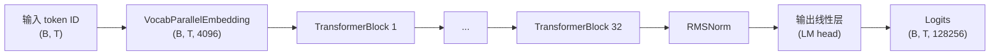
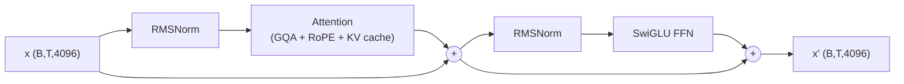
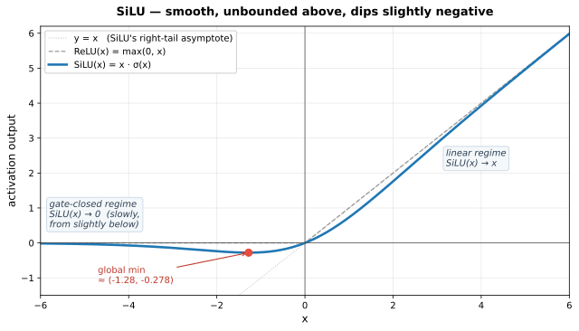
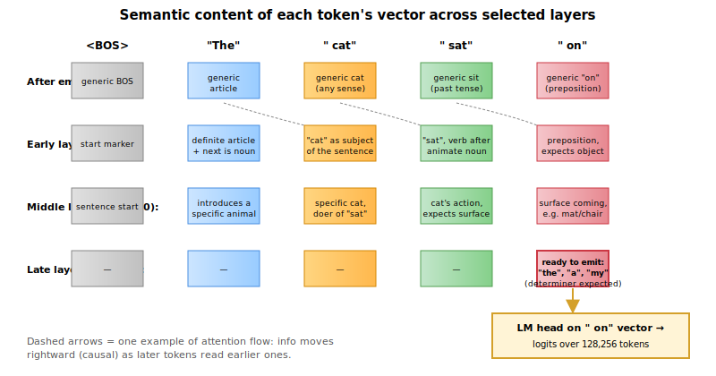

# Llama 3 —— 学习指南

> 本文基于参考实现生成的笔记：[llama/model.py](https://github.com/meta-llama/llama3/blob/main/llama/model.py)、[llama/generation.py](https://github.com/meta-llama/llama3/blob/main/llama/generation.py) 和 [llama/tokenizer.py](https://github.com/meta-llama/llama3/blob/main/llama/tokenizer.py)。
>
> **关于渲染：** 所有公式都写在代码块里，用 Unicode 符号表示 —— 这样在任何 Markdown 阅读器里都能正常显示（VS Code 内置预览、GitHub、Typora、Obsidian 等），不需要额外的 KaTeX 插件。示意图都以 SVG 文件引入，同样在所有环境下都能稳定渲染。

---

## 1. 一句话总结（俯视视角，一段话）

Llama 3 是 Meta 于 2024 年发布的开源权重大语言模型 —— 一个**仅解码器 (decoder-only) 的 Transformer**：接收一串文本 token，一次预测一个后续 token。它提供 8B 和 70B 两种参数规模，支持 8,192 token 的上下文窗口。从架构上讲，它与 GPT、Llama 2 同属一个家族：层层堆叠的 Transformer block，每个 block 都包含自注意力和前馈网络。它之所以值得关注，不是因为某个新的架构创新，而是一组针对 2017 年原始 Transformer 的"现代化改造"都调得很到位：用 **RMSNorm** 替换 LayerNorm（更省，无偏置），用 **RoPE** 替换可学习的位置嵌入（更擅长外推到更长序列），用 **SwiGLU** 替换 ReLU MLP（同样 FLOP 下质量更好），用**分组查询注意力 (Grouped-Query Attention, GQA)** 让推理时的 KV 缓存保持小规模。和 Llama 2 相比架构几乎没变 —— 真正的跃进是词表扩大了 4 倍（128K，基于 tiktoken）、上下文加长 2 倍（8K vs 4K）、RoPE 基频大得多（500,000 vs 10,000）以避免长上下文下的频率混叠，以及大幅增加了训练数据（约 15T token）。

---

## 2. 30 秒理解全貌




**每一个 TransformerBlock 内部**（pre-norm 残差结构）：




这两张图就是整个模型。本笔记剩下的部分会把每个方框展开讲。

---

## 3. 关键超参数（附带直觉）

这些是 [llama/model.py:20-32](https://github.com/meta-llama/llama3/blob/main/llama/model.py#L20-L32) 中 `ModelArgs` 的默认值，叠加上推理代码从磁盘 `params.json` 中读到的 **真实** 8B 参数。


| 参数                 | 值 (8B)      | 它控制什么                                                                              | 为什么选这个值                                                                  |
| -------------------- | ---------- | ----------------------------------------------------------------------------------- | ----------------------------------------------------------------------- |
| `dim`                | 4096       | 残差流的宽度 —— 每个 token 都表示为一个 4096 维向量，每个 block 都会读写它。                 | 越宽 ⇒ 每个 token 的表达能力越强。4096 是"中等宽度"的标准选择。                    |
| `n_layers`           | 32         | 深度：堆叠多少个 Transformer block。深度决定了模型能做多少"推理跳步"。                     | 越深 ⇒ 串行计算越多 / 推理深度越大。32 是 Llama 8B 类模型的标准。                   |
| `n_heads`            | 32         | 查询 (Query) 注意力头的数量。                                                              | `head_dim = dim / n_heads = 128`。128 是 GPU tensor core 的最优尺寸。           |
| `n_kv_heads`         | 8          | **共享的** KV 头数（GQA）。32 个 Q 头被分成 8 组，每组 4 个共享同一对 K 和 V。             | 推理时 KV 缓存缩小 4 倍，质量几乎无损。                                           |
| `vocab_size`         | 128,256    | token 词表大小。§4.1 会解释这里的"128K"到底是什么意思。                                    | 比 Llama 2 的 32K 大 4 倍 —— 同样的文本少用约 15% 的 token。                       |
| `multiple_of`        | 1024       | 把 FFN 的隐藏维度向上取整到这个值的倍数，让形状对硬件友好。                                | 倍数越大 ⇒ tensor core 越舒服；代价是 FFN 稍微变大一点。                           |
| `ffn_dim_multiplier` | 1.3        | FFN 隐藏维度的额外放缩因子。                                                                | 把 FFN 隐藏维度拉到大约 `3.47·dim`，Llama 3 实验发现这个比例更好。                  |
| `norm_eps`           | 1e-5       | RMSNorm 的数值稳定 ε。                                                                      | 防止当激活接近 0 时除零。                                                     |
| `rope_theta`         | 500,000    | RoPE（旋转位置编码）的基频。                                                                | Llama 2 用 10,000。基频越大 ⇒ 正弦函数转得越慢 ⇒ 对长上下文的支持越好。               |
| `max_batch_size`     | 32         | 按这个 batch 大小预分配 KV 缓存。                                                         | 静态缓存尺寸 —— 用内存换掉重新分配的开销。                                        |
| `max_seq_len`        | 最多 8192   | 最大上下文长度，在 `Llama.build` 中断言。                                                  | 决定了缓存长度和 RoPE 表的长度。                                                |


---

## 4. 架构细节走读

### 4.1 分词器与嵌入

**是什么。** 一个 `text → list[int]` 的函数，加上一个 `int → vector` 的查表。

**为什么需要它。** 神经网络只吃数字。我们需要一种可逆的方式把文本切成整数 ID，再用一个可训练的表把每个 ID 映射到 4096 维向量（"词嵌入"）。

#### 🤔 "词表大小是 128,256 —— 世界上的词明明远远不止这么多吧？"

这个问题问得对，答案是：**token 不是词**。

Token 是**子词片段 (sub-word pieces)**，由一种叫 **BPE（Byte Pair Encoding，字节对编码）** 的算法学出来的。BPE 从原始字节（256 个）开始，反复把最频繁出现的相邻对合并成一个新 token。常见的完整词会变成单个 token；罕见词会被拆成几个片段；完全见都没见过的字符串会回退到单个字节。所以 128,256 个 token 可以表示**任何** UTF-8 文本，包括分词器从未见过的语言和 emoji —— 只是会占更多 token。

具体来说（用 Llama 3 的分词器）：


| 文本                              | Token（大致）                                                   | 数量     |
| --------------------------------- | ------------------------------------------------------- | -------- |
| `" cat"`                          | `[" cat"]`                                              | 1        |
| `" hippopotamus"`                 | `[" hippo", "pot", "amus"]`                             | 3        |
| `" antidisestablishmentarianism"` | `[" anti", "dis", "establish", "ment", "arian", "ism"]` | 6        |
| `" 你好"`                         | 多字节回退 token                                             | 2–3      |
| `" 🚀"`                           | 4 个字节级 token                                          | 4        |


**类比。** 英语有几百万种词形，却只有 26 个字母。BPE 处在这两个极端之间 —— 一张由"词片段"构成的词表，可以拼出任意内容。128K 已经足够大，能让最常见的约 2 万个英文词成为单 token，而罕见 / 技术 / 多语言字符串会被拆开。

**为什么是 128K，不是 50K 或 500K？** 词表越大 → token 序列越短 → 每句耗算力越少 → 实际上下文更长。但同时 → 嵌入表更大（128K × 4096 ≈ 5.25 亿参数，光嵌入层就要这么多）、LM head 也更大。Llama 3 把 128K 选为平衡点。Llama 2 用 32K，GPT-4 大约用 100K。

#### 正则表达式与特殊 token

```python
# llama/tokenizer.py:47 —— 这个正则定义了 BPE 合并前"原始片段"的切法。
# 把文本切成缩写、单词、短数字串、标点、空白。
pat_str = r"(?i:'s|'t|'re|'ve|'m|'ll|'d)|[^\r\n\p{L}\p{N}]?\p{L}+|\p{N}{1,3}| ?[^\s\p{L}\p{N}]+[\r\n]*|\s*[\r\n]+|\s+(?!\S)|\s+"

# 特殊 token 占据词表顶部 256 个槽位：
special_tokens = [
    "<|begin_of_text|>",     # BOS: 任何输入的起始
    "<|end_of_text|>",       # EOS: 纯文本续写的结束
    "<|start_header_id|>",   # 聊天格式里 role 标签的包裹符
    "<|end_header_id|>",
    "<|eot_id|>",            # "end of turn" —— 分隔聊天消息
    # ... + 约 250 个保留槽位以备将来使用
]
```

#### 嵌入查表

[llama/model.py:280](https://github.com/meta-llama/llama3/blob/main/llama/model.py#L280)：

```python
h = self.tok_embeddings(tokens)   # tokens: (B, T) int   →   h: (B, T, 4096)
```

`VocabParallelEmbedding` 就是一张形状为 `(128256, 4096)` 的大查找矩阵，跨 GPU 分片存放 —— 功能上等同于 `nn.Embedding`。**每一行是一个 4096 维向量，总共有 128,256 行。** token ID *i* 就是取第 *i* 行。

位置信息**不**在这里注入，要等到注意力内部的 RoPE 那一步。

---

### 4.2 位置编码：旋转位置编码 (RoPE)

**是什么。** 通过在二维子空间里**旋转** query 和 key 向量来注入位置信息的一种方式。

**为什么需要它。** 自注意力本身是置换不变的 —— 没有位置信息的话，"狗咬人"和"人咬狗"对它来说是一样的。RoPE 注入位置的方式满足以下好处：(a) 不引入额外参数，(b) 注意力里自然地编码了**相对**位置（位置 *i* 和 *j* 之间的相似度只取决于 `i − j`），(c) 对超出训练长度的上下文外推得不错。

#### 数学公式

对一个在位置 **m** 的 query 向量 **q**（d 维）。把 d 维分成 d/2 对：(q₀, q₁), (q₂, q₃), …。每一对视为一个 2D 向量，**旋转**一个同时取决于位置 m 和第几对的角度。

对第 k 对（下标 2k 和 2k+1），旋转角度为 m·θₖ，其中：

```
θₖ = θ_base ^ (−2k/d),     k = 0, 1, …, d/2 − 1
```

在 Llama 3 中，θ_base = 500,000，d = 128（head_dim），所以 θ₀ = 1（转得最快），一直到 θ₆₃ ≈ 1/500,000（转得最慢）。

第 k 对在位置 m 的 2D 旋转：

```
⎛ q'₂ₖ   ⎞   ⎛ cos(m·θₖ)   −sin(m·θₖ) ⎞ ⎛ q₂ₖ   ⎞
⎜        ⎟ = ⎜                        ⎟ ⎜       ⎟
⎝ q'₂ₖ₊₁ ⎠   ⎝ sin(m·θₖ)    cos(m·θₖ) ⎠ ⎝ q₂ₖ₊₁ ⎠
```

RoPE 起作用的关键性质：

```
⟨ R_m · q ,  R_n · k ⟩   =   ⟨ q ,  R_(n−m) · k ⟩
```

翻译：位置 m 的 query 和位置 n 的 key 旋转后再做的点积，**只取决于差值 n − m**，与它们的绝对位置无关。这就是这里"相对位置"的含义。

#### 示意图：旋转一对


向量的**长度从不改变** —— 旋转只在单位圆上移动它。变化的是它的*角度*，而这个角度就编码了位置。

#### 数值化示例

用一个迷你的 head_dim d = 4（只有 2 对）和 θ_base = 10,000，方便读数。

频率：

```
θ₀ = 10000^(−0/4) = 1
θ₁ = 10000^(−2/4) = 10000^(−0.5) = 0.01
```

取一个 query 向量 q = [1, 0, 1, 0]，在**位置 m = 2** 旋转：

- **第 0 对** (q₀, q₁) = (1, 0)。角度 = 2 · 1 = 2 弧度。
  新对 = (cos 2, sin 2) = (−0.416, 0.909)。
- **第 1 对** (q₂, q₃) = (1, 0)。角度 = 2 · 0.01 = 0.02 弧度。
  新对 = (cos 0.02, sin 0.02) = (0.9998, 0.020)。

所以 R₂·q ≈ [−0.416, 0.909, 0.9998, 0.020]。

同一个 q 在**位置 m = 5** 会变成：

- 第 0 对：角度 = 5 弧度 → (cos 5, sin 5) = (0.284, −0.959)
- 第 1 对：角度 = 0.05 弧度 → (0.9988, 0.050)

所以 R₅·q ≈ [0.284, −0.959, 0.9988, 0.050]。

注意：

1. **低频对**（第 1 对，θ₁ 很小）几乎没动 —— 位置 2 到 5 之间变化很微弱。它追踪的是"远距离尺度"的位置。
2. **高频对**（第 0 对，θ₀ = 1）在圆上几乎转了半圈。它追踪的是"近距离尺度"的位置。
3. 不同的对 = 不同速度的时钟指针。合起来就是每个 m 的一张唯一"位置指纹"。

现在是点睛之笔。假设一个 key k = [1, 0, 1, 0] 在位置 n = 3（所以 n − m = 3 − 2 = 1）。你可以自行验证点积 ⟨R₂·q, R₃·k⟩ 等于 ⟨q, R₁·k⟩ —— 注意力只在乎**相对偏移**，不在乎绝对下标。

> ⚠️ **容易搞错的地方：** RoPE 只应用到 **Q 和 K**，**不**应用到 V。它的目的是让 ⟨qᵢ, kⱼ⟩ 编码 i − j。value 不参与位置相关的内积，旋转它们只会添乱。

#### 为什么这比原始（2017）位置编码更好？

2017 年的 Transformer 用的是**正弦绝对位置**编码：每个位置一个固定的（非学习的）向量，在输入层*加到* token 嵌入上。GPT-2 用的是可学习的绝对嵌入 —— 思路一样，只是位置向量是可训练的。RoPE 在四个方面都比它们强：

**1. 按定义就是相对的，而不是碰运气。** 正弦编码给模型两个*绝对*位置（pos_i 和 pos_j），指望注意力自己推出来"距离 = j − i"。RoPE 直接以恒等式的形式把相对位置内建了：

```
⟨ R_m · q ,  R_n · k ⟩   =   ⟨ q ,  R_(n−m) · k ⟩
```

注意力看到的永远是相对偏移，而这恰恰是它真正关心的 —— "那个 token 在我前面多远？"几乎永远比"我的绝对下标是多少？"更有用。

**2. 每一层都注入，不是只注入一次。** 正弦 / 可学习绝对编码只在输入嵌入处加*一次*。经过 32 层残差加法、归一化、SwiGLU 非线性之后，这个位置信号会越来越糊 —— 后面的层工作在它的一个"糊糊的回声"上。RoPE 在*注意力内部*每一层都应用一次，所以 Q 遇到 K 时，位置信息总是新鲜的。

**3. 不污染 value。** 正弦编码把位置混进整条残差流，所以 value V 会在内容之外带着位置信号。RoPE 只旋转 Q 和 K。Value 保持纯粹的*内容* —— 真正被搬运的东西，和"它从哪儿来"解耦。

**4. 向更长上下文外推。** 正弦的理论外推在实践中平平；可学习绝对编码**根本**不外推（位置 8193 根本没有对应的向量）。RoPE 在超过训练长度后还能优雅地退化，再加上便宜的微调 —— 比如 Llama 3 把 θ_base 从 10,000 改成 500,000，或用 YaRN、NTK-aware scaling 之类的方法 —— 上下文可以远远拉伸到训练窗口之外，几乎不需要重新训练。

**一句话版本：** 正弦编码说的是"你在*哪里*"；RoPE 说的是"你和另一个 token *相距多远*" —— 而这才是注意力真正在问的问题。

#### 代码

```python
# llama/model.py:49-54 —— 一次性预计算好复指数。
def precompute_freqs_cis(dim: int, end: int, theta: float = 10000.0):
    # freqs[k] = 1 / theta^(2k/dim)  k = 0, 2, ..., dim-2
    freqs = 1.0 / (theta ** (torch.arange(0, dim, 2)[: (dim // 2)].float() / dim))
    t = torch.arange(end, device=freqs.device, dtype=torch.float32)   # 位置 0..end-1
    freqs = torch.outer(t, freqs)                        # (end, dim/2) —— 每个 (位置, 对) 的角度
    # torch.polar(1, angle) = e^(i·angle) —— 单位圆上的纯旋转。
    freqs_cis = torch.polar(torch.ones_like(freqs), freqs)   # complex64, (end, dim/2)
    return freqs_cis

# llama/model.py:65-75 —— 把旋转应用到 q 和 k。
def apply_rotary_emb(xq, xk, freqs_cis):
    # 把最后一维看成对：(..., d) → (..., d/2, 2) → 视为复数。
    xq_ = torch.view_as_complex(xq.float().reshape(*xq.shape[:-1], -1, 2))
    xk_ = torch.view_as_complex(xk.float().reshape(*xk.shape[:-1], -1, 2))
    freqs_cis = reshape_for_broadcast(freqs_cis, xq_)
    # 复数乘法 = 每一对按它的位置相关角度旋转。
    xq_out = torch.view_as_real(xq_ * freqs_cis).flatten(3)
    xk_out = torch.view_as_real(xk_ * freqs_cis).flatten(3)
    return xq_out.type_as(xq), xk_out.type_as(xk)
```

巧妙的地方是把每一对表示成复数 x + iy，然后用复数乘法 —— 因为 (x + iy) · e^(iφ) 本来就是 (x, y) 绕原点旋转角度 φ。优雅。

---

### 4.3 归一化：RMSNorm

**是什么。** 一种更简单、更省的 LayerNorm 变体。

**为什么需要它。** LayerNorm 减均值、除以标准差、还带一个可学习的偏置。经验上，减均值和偏置贡献很小；去掉它们能让运算快约 20%，质量不掉。

**公式：**

```
                     x
RMSNorm(x)  =  ────────────────────────  ⊙  γ
                √( (1/d) Σᵢ xᵢ²  +  ε )
```

和 LayerNorm 对比：

```
                    x − μ
LayerNorm(x)  =  ─────────────  ⊙  γ  +  β
                  √(σ² + ε)

     其中    μ  = (1/d) Σᵢ xᵢ
             σ² = (1/d) Σᵢ (xᵢ − μ)²
```

RMSNorm 去掉了 μ（减均值）和 β（偏置）。这就是全部差别。

```python
# llama/model.py:35-46
class RMSNorm(torch.nn.Module):
    def __init__(self, dim: int, eps: float = 1e-6):
        super().__init__()
        self.eps = eps
        self.weight = nn.Parameter(torch.ones(dim))   # 每维可学习放缩 γ

    def _norm(self, x):
        # rsqrt(mean(x²) + ε)  —— RMS 的倒数。不减均值。
        return x * torch.rsqrt(x.pow(2).mean(-1, keepdim=True) + self.eps)

    def forward(self, x):
        # 把平方那一步上调到 fp32 保证数值稳定，然后转回。
        output = self._norm(x.float()).type_as(x)
        return output * self.weight
```

**Pre-norm 对比 post-norm。** Llama 3 用的是 **pre-norm**：归一化应用到每个子层的*输入*，而不是残差相加后的结果。见 [llama/model.py:246-247](https://github.com/meta-llama/llama3/blob/main/llama/model.py#L246-L247)：

```python
h   = x + self.attention(self.attention_norm(x), ...)   # 归一化后的输入 → 注意力 → 残差相加
out = h + self.feed_forward(self.ffn_norm(h))           # 归一化后的输入 → FFN → 残差相加
```

Pre-norm 在深层网络里训练更稳定 —— 残差"高速公路"从不经过归一化，所以梯度能干净地从头流到尾。

---

### 4.4 注意力：分组查询注意力 (GQA) 与 KV 缓存

**是什么。** 每个 token 用来吸收前面 token 信息的机制。

**为什么需要它。** 每个 token 会产生三个向量：**query**（我在找什么？）、**key**（我能提供什么？）、**value**（如果匹配到了应该传递什么？）。注意力的输出是 value 的加权平均，权重来自 query-key 相似度。

#### 数学公式

标准的缩放点积注意力：

```
                               ⎛  Q · Kᵀ  ⎞
Attention(Q, K, V)  =  softmax ⎜ ──────── ⎟ · V
                               ⎝   √dₖ    ⎠
```

其中 Q ∈ ℝ^(T × dₖ)，K ∈ ℝ^(T × dₖ)，V ∈ ℝ^(T × d_v)。除以 √dₖ 是为了防止 dₖ 很大时 softmax 饱和（dₖ 个独立同分布项的点积方差与 dₖ 同量级增长）。

多头情况下就是把这套并行地重复 h 次，每次用不同的投影矩阵，然后拼起来。在 GQA 里，**query** 依然有 h 个头，但 **key 和 value** 只有 h_kv < h 个头，每个 KV 头被一组 h / h_kv 个 query 头共享。

#### GQA 为什么有效？会不会丢细节？

担心是对的 —— 乍一看，4 个 query 头去读同一对共享的 KV，直觉上*应该*比各有各的 KV 差。而实际上不会，原因：

1. **在普通 MHA 里，很多头学到的 K/V 模式是冗余的。** GQA 论文（Ainslie et al., 2023）指出：在一个训好的 Transformer 里看每个 K 和 V 头真正学到什么，会发现大量重复。我们是在付费把几乎一样的东西重复存 4 次。
2. **多样性在 query 里，内容在 key/value 里。** 一组里的 4 个 query 仍然问 4 个*不同*的问题，它们只是查同一本证据。打个比方：4 个学生读同一本教科书但作业题不同，他们得到不同的答案是因为他们的问题不同。
3. **经验上质量损失很小。** 在 Llama 规模的模型上从 MHA → GQA-8（32 Q, 8 KV），困惑度只增加约 0.1–0.3 个点。继续到 MQA（32 Q, 1 KV），会掉约 1 个点 —— 那才是拐点。GQA 就坐在拐点上。
4. **收益巨大。** KV 缓存是**长上下文推理的主要显存消耗**。缩小 4 倍 = 4 倍更长的上下文，或 4 倍更大的 batch，（大致）质量不变。

#### 图解 GQA 结构


#### KV 缓存 —— 如何工作，为何必要

**它解决的问题。** 在自回归生成中，模型一次产一个 token。朴素做法是：第 t 步时对 tokens [0, 1, …, t] 跑一次完整前向。但 token 0 到 t−1 的 Q/K/V 投影在**上一步就已经算过了** —— 它们是这些输入 token 的确定性函数，重新算就是浪费。

**核心思路。** 把所有过去 token 的 Kⱼ 和 Vⱼ 存起来。第 t 步只算最新 token 的 Qₜ、Kₜ、Vₜ，把 Kₜ、Vₜ 追加到缓存，然后在 Qₜ 和整个缓存的 K[0..t]、V[0..t] 之间做注意力。

**不缓存的是：query。** 第 t 步的 Q 只用一次 —— 用来算第 t 步的注意力分数 —— 然后就被丢弃。存它纯粹浪费内存。（唯一的例外是 prefill 那一步：我们一次算很多 token，它们的 Q 也是只用一次就扔。）

**缓存大小**（Llama 3 8B 在最大上下文下，bf16）：

```
cache_bytes  =  2  ×  n_layers  ×  n_kv_heads  ×  d_head  ×  T  ×  每元素字节数
             =  2  ×    32      ×      8       ×   128    × 8192 ×       2
             ≈  每条序列约 1.07 GB
```

如果是 MHA（n_kv = 32），就变成约 4.3 GB。这才是 GQA 在实际操作上的具体收益。

#### 图解：三个时间步里缓存的演化


#### 构造函数

```python
# llama/model.py:90-144 —— Attention 构造函数（精简版）
class Attention(nn.Module):
    def __init__(self, args):
        super().__init__()
        self.n_kv_heads = args.n_kv_heads or args.n_heads   # Llama 3 8B 里是 8
        self.n_local_heads    = args.n_heads    // mp_size  # 32 个 Q 头
        self.n_local_kv_heads = self.n_kv_heads // mp_size  # 8  个 KV 头
        self.n_rep = self.n_local_heads // self.n_local_kv_heads   # 4
        self.head_dim = args.dim // args.n_heads                   # 128

        self.wq = ColumnParallelLinear(args.dim, args.n_heads * self.head_dim, bias=False, ...)
        self.wk = ColumnParallelLinear(args.dim, self.n_kv_heads * self.head_dim, bias=False, ...)
        self.wv = ColumnParallelLinear(args.dim, self.n_kv_heads * self.head_dim, bias=False, ...)
        self.wo = RowParallelLinear(args.n_heads * self.head_dim, args.dim, bias=False, ...)

        # 预分配的静态 KV 缓存。形状：(max_batch, max_seqlen, n_kv_heads, head_dim)
        self.cache_k = torch.zeros((args.max_batch_size, args.max_seq_len,
                                    self.n_local_kv_heads, self.head_dim)).cuda()
        self.cache_v = torch.zeros_like(self.cache_k)
```

#### 前向传播

```python
# llama/model.py:146-190
def forward(self, x, start_pos, freqs_cis, mask):
    bsz, seqlen, _ = x.shape                  # x: (B, T_new, 4096) —— 解码时 T_new=1
    xq, xk, xv = self.wq(x), self.wk(x), self.wv(x)
    xq = xq.view(bsz, seqlen, self.n_local_heads,    self.head_dim)   # (B, T_new, 32, 128)
    xk = xk.view(bsz, seqlen, self.n_local_kv_heads, self.head_dim)   # (B, T_new,  8, 128)
    xv = xv.view(bsz, seqlen, self.n_local_kv_heads, self.head_dim)   # (B, T_new,  8, 128)
    xq, xk = apply_rotary_emb(xq, xk, freqs_cis=freqs_cis)             # RoPE 只作用于 Q 和 K

    # 写入：把新的 K/V 存到缓存的 [start_pos, start_pos+seqlen) 位置
    self.cache_k[:bsz, start_pos : start_pos + seqlen] = xk
    self.cache_v[:bsz, start_pos : start_pos + seqlen] = xv

    # 读取：从位置 0 一直到新 token 的末尾
    keys   = self.cache_k[:bsz, : start_pos + seqlen]   # (B, T_total, 8, 128)
    values = self.cache_v[:bsz, : start_pos + seqlen]

    # GQA 扩展：把 8 个 KV 头各复制 4 份 → 32 头以对齐 Q。
    # 纯内存视图，不是新计算。
    keys   = repeat_kv(keys,   self.n_rep)   # (B, T_total, 32, 128)
    values = repeat_kv(values, self.n_rep)

    # 以下是标准的注意力。
    xq    = xq.transpose(1, 2)                # (B, 32, T_new,   128)
    keys  = keys.transpose(1, 2)              # (B, 32, T_total, 128)
    values= values.transpose(1, 2)
    scores = torch.matmul(xq, keys.transpose(2, 3)) / math.sqrt(self.head_dim)
    if mask is not None: scores = scores + mask
    scores = F.softmax(scores.float(), dim=-1).type_as(xq)
    output = torch.matmul(scores, values)
    output = output.transpose(1, 2).contiguous().view(bsz, seqlen, -1)
    return self.wo(output)
```

---

### 4.5 前馈网络：SwiGLU

**是什么。** 一个带门控机制的两层 MLP。

**为什么需要它。** 经典 Transformer 的 FFN 是 `Linear → ReLU → Linear` —— 在注意力完成信息混合之后，让 token 逐位做一点非线性运算。SwiGLU 用一个门控变体替换了它，经验上在相同参数量下 loss 更低。

#### 数学公式

```
                              x
SiLU(x)  =  x · σ(x)  =  ─────────────
                          1 + e^(−x)
```

```
SwiGLU(x)  =  W₂ · (  SiLU(W₁·x)   ⊙   (W₃·x)  )
             └降维┘  └── 门 ──┘         └ 升维 ┘
```

不是两个投影而是三个：W₁（"门"投影，过 SiLU）、W₃（"升维"投影，无激活）、W₂（"降维"投影，回到 model dim）。SwiGLU 算子就是前两者的逐元素乘积。

#### 值域与极端情形（深入看 SiLU）



从图上可以读出三件事：

- **右侧是线性的**，所以对较大的正 x，SiLU 行为近似恒等（对比虚线 `y = x`）。
- **不像 ReLU 那样在 0 处截止。** SiLU 会轻微下探到负值，全局最小值大约在 `(−1.28, −0.278)`（红点标出）。这是 SwiGLU 可以利用的"负门"。
- **左侧光滑地接近 0，但速度很慢** —— 在 `x = −10` 处，SiLU 仍然约为 `−4.5 × 10⁻⁴`。不是 0，只是极小。关键是在 `x = 0` 处没有拐点（不像 ReLU），这对优化时的梯度流很有帮助。

**SwiGLU 的值域。** SiLU(W₁·x) ⊙ (W₃·x) 在两个方向上都**无界**，且不是单调的。把 W₁·x 看作"软门"（叫它 a），把 W₃·x 看作"信号"（叫它 b）：


| 门值 a = W₁·x          | SiLU(a) 行为  | 对输出通道的净影响                                     |
| ------------------------ | ---------------- | ----------------------------------------------------- |
| a ≫ 0（大正数）           | SiLU ≈ a         | 门大开，输出 ≈ a · b —— 以乘积增长                      |
| a ≈ 0                    | SiLU ≈ 0         | 门几乎关闭，输出 ≈ 0                                   |
| a ≈ −1.28（SiLU 最小处） | SiLU ≈ −0.28     | 小的负门 —— 不常见，会让信号反号但幅度小                |
| a ≪ 0（大负数）           | SiLU → 0         | 门关闭，输出 ≈ 0                                        |


**极端情形 1 —— 全部门关闭。** 如果某个 token 的每个 W₁·x 坐标都非常负，SiLU 会把它们全往 0 按，SwiGLU 输出 ≈ 0，FFN 对这个 token 实际上是一个空操作。它只靠残差连接通过。

**极端情形 2 —— 全部门大开。** 如果 W₁·x 和 W₃·x 都是很大的正数，SwiGLU 输出 ≈ (W₁·x) ⊙ (W₃·x) —— 这会随输入幅度**平方增长**。这也是前置 RMSNorm 重要的原因：它把输入幅度限制住，避免 SwiGLU 爆炸。在 bf16 下，这里不受控的增长会溢出。

**极端情形 3 —— "负门"的怪癖。** 和 ReLU 型的门不同，SwiGLU 的门可以轻微为负。这意味着 SwiGLU 能主动*反转*一个信号通道，而不是只能通过或阻止。这种额外的表达能力到底"有用"还是"好玩"有争议；经验上不会有坏影响，而且它让函数光滑，优化会更顺。

#### 代码

```python
# llama/model.py:193-219
class FeedForward(nn.Module):
    def __init__(self, dim, hidden_dim, multiple_of, ffn_dim_multiplier):
        super().__init__()
        # 普通 Transformer 用 hidden = 4·dim。SwiGLU 有两个并行的升维投影，
        # 所以我们把 hidden 缩小 2/3，以保持整体参数预算一致。
        hidden_dim = int(2 * hidden_dim / 3)
        if ffn_dim_multiplier is not None:
            hidden_dim = int(ffn_dim_multiplier * hidden_dim)   # Llama 3: ×1.3
        hidden_dim = multiple_of * ((hidden_dim + multiple_of - 1) // multiple_of)

        self.w1 = ColumnParallelLinear(dim, hidden_dim, bias=False, ...)   # 门 (gate) 投影
        self.w2 = RowParallelLinear(hidden_dim, dim, bias=False, ...)      # 降维 (down) 投影
        self.w3 = ColumnParallelLinear(dim, hidden_dim, bias=False, ...)   # 升维 (up) 投影

    def forward(self, x):
        # SwiGLU：(SiLU 激活的门) 和 (升维投影) 的逐元素乘积。
        return self.w2(F.silu(self.w1(x)) * self.w3(x))
        #        └── 降维 ──┘ └── 门 ──┘   └── 升维 ┘
```

形状：`x: (B, T, 4096)` → `w1(x), w3(x): (B, T, 14336)` → 逐元素相乘：`(B, T, 14336)` → `w2(·): (B, T, 4096)`。

---

### 4.6 TransformerBlock

注意力 + FFN 合在一起，pre-norm 残差：

```python
# llama/model.py:239-248
def forward(self, x, start_pos, freqs_cis, mask):
    # 注意力子块：归一化 → 注意力 → 加入残差。
    h = x + self.attention(self.attention_norm(x), start_pos, freqs_cis, mask)
    # FFN 子块：归一化 → SwiGLU → 加入残差。
    out = h + self.feed_forward(self.ffn_norm(h))
    return out
```

两个子层，两次残差相加，两个 RMSNorm。Llama 3 8B 把这个 block 重复 32 次。

### 4.7 LM head

**是什么。** 从 4096 维残差流到 128,256 维词表 logit 空间的最终投影。

```python
# llama/model.py:266-269
self.norm   = RMSNorm(params.dim, eps=params.norm_eps)
self.output = ColumnParallelLinear(params.dim, params.vocab_size, bias=False, ...)
```

> ⚠️ **没有权重绑定。** 有些 Transformer 让 token 嵌入和输出投影共享权重。Llama 3 **没有** —— `tok_embeddings` 和 `output` 是两个独立的张量。代价是大约多 5.25 亿参数，好处是解除了一个在大词表上可能反伤质量的约束。

### 4.8 因果掩码

因为 Llama 3 是仅解码器的自回归模型，位置 *i* 必须看不到位置 > i。掩码在 `Transformer.forward` 中构造，在 softmax 之前加到注意力分数上：

```python
# llama/model.py:284-296
mask = None
if seqlen > 1:   # 解码单个 token 时不需要掩码
    mask = torch.full((seqlen, seqlen), float("-inf"), device=tokens.device)
    mask = torch.triu(mask, diagonal=1)    # 对角线上方填 -inf，对角线及以下填 0
    # 有了 KV 缓存后，新 token 可以看到所有已缓存 token；在左侧前置 `start_pos` 列零。
    mask = torch.hstack(
        [torch.zeros((seqlen, start_pos), device=tokens.device), mask]
    ).type_as(h)
```

---

## 5. 一个具体的前向传播：把 "The cat sat on" 喂给模型

上一节解释了各个零件。这一节拿一个真实的小句子，一步一步追踪它的向量发生了什么。token、形状、语义描述 —— 每一步都落到实处。

**输入：**`"The cat sat on"`（一个不完整的句子；我们想让模型预测接下来会出现什么）。

### 第 1 步 —— 分词

用 Llama 3 的 tiktoken BPE（ID 是近似值，可能有出入）：

```
"The cat sat on"
  ↓  总是在最前面加 BOS。
[<|begin_of_text|>, "The", " cat", " sat", " on"]
[    128000      ,  791 ,  8415 ,  7731 ,  389 ]
```

序列长度 T = 5。当前形状：`(1, 5)` —— 一个 batch，五个 token ID。

### 第 2 步 —— 嵌入

`h = tok_embeddings(tokens)` → 形状 `(1, 5, 4096)`。

每个 ID 取 (128256, 4096) 查找表里的一行。此时 " cat" 对应的向量是一个**通用的、无上下文的"cat"向量** —— 不管这句话说的是宠物、服装还是 Unix 命令，长得都一样。

### 第 3 步 —— 穿过 32 个 block（图示）

在每个 block 里，每个 token 的 4096 维向量 (a) 通过注意力吸收来自句子中*其他* token 的信息，(b) 通过逐 token 的 FFN 被进一步加工。下面这张图画的是，每个 token 的向量的**上下文化内容**在关键层上如何演化：



*彩色方框是同一个 5 个 token 位置。每一行里写的内容是"该层上向量编码着什么语义"的卡通版本。形状始终不变 —— 永远是* `(1, 5, 4096)`*。*

**底层实际发生了什么（一个 block 内部）：**


| 阶段                             | 对 " cat"（位置 2）                                                                                         | 形状                                        |
| ------------------------------ | --------------------------------------------------------------------------------------------------------- | ----------------------------------------- |
| `attention_norm`               | 把向量按 RMS 重新归一化                                                                                    | `(1, 5, 4096)`                              |
| `wq, wk, wv`                   | 投影到 32 个 Q 头、8 个 K 头、8 个 V 头                                                                     | Q: `(1, 5, 32, 128)`, K/V: `(1, 5, 8, 128)` |
| RoPE 应用到 Q, K                | 按位置 2 的角度逐对旋转                                                                                    | 形状不变                                    |
| 写入缓存                        | `cache_k[0, 2] = xk[:, 2]`；V 同理                                                                         | —                                           |
| 注意力                          | " cat"（位置 2）因果掩码下只能看到位置 0-2 → 注意力分数在 BOS、"The"、自己身上最高                             | `scores: (1, 32, 5, 5)`                    |
| `wo` + 残差                     | 投影回 4096，加到输入上                                                                                    | `(1, 5, 4096)`                              |
| `ffn_norm` + SwiGLU + 残差     | 逐 token 的非线性加工                                                                                      | `(1, 5, 4096)`                              |


重复 32 次。每一次，都有更多上下文被混入，更多抽象特征被构建。到最后几层，每个 token 的向量主要在表达"我之后最可能接哪个 token？"。

### 第 4 步 —— 最后的归一化 + LM head

取最后一个 token（位置 4 的 " on"）的最终隐藏状态：

```python
h_last = h[:, -1, :]          # (1, 4096) —— " on" token 的最终向量
h_last = self.norm(h_last)    # RMSNorm
logits = self.output(h_last)  # (1, 128256) —— 词表里每个 token 一个分数
```

对这个句子来说，概率最高的下一个 token 大致是：

```
" the"  → logit 约 12.1    （非常可能 —— "on the ___"）
" a"    → logit 约 10.8
" my"   →   8.4
" his"  →   7.9
...
" ceiling" → 2.1        （这里没意义 —— 分数低）
```

### 第 5 步 —— 采样

`temperature = 0.6`、`top_p = 0.9`，我们把 logits 除以 0.6（让分布更尖锐），softmax 得到概率，保留累计质量刚好越过 0.9 的最小集合，采样。大概率会得到 `" the"`。

### 第 6 步 —— 下一个 token（KV 缓存登场）

现在我们有 `"The cat sat on the"`，想生成第 6 个 token。我们**不**会重新处理整个句子。而是：

```
tokens = [" the"]           # 只是那个新 token
start_pos = 5
```

每一层：

- 只为位置 5 计算 Q₅、K₅、V₅ —— 一次 `(1, 1, 4096)` 大小的前向
- 把 K₅、V₅ 写入缓存的第 5 槽
- 注意力：Q₅ 与缓存中的 K₀ 到 K₅（全部 6 个）做点积，加权之后与 V₀ 到 V₅ 求和
- 结果穿过 FFN、残差，进入下一层

预测出来的下一个 token：大概是 `" mat"`（把那个经典的儿童绘本句子补完）。

这一步的总工作量：对一个 1-token 输入的一次前向，加上缓存读取。每步都对整个前缀重新做注意力的二次方代价被避开了 —— 只有最新的 K 和 V 是新计算出来的。

---

## 6. 训练与推理的差异

本仓库的参考代码是**仅推理**的 —— 没有训练循环。尽管如此，还是值得点出两边代码路径的差别：


| 方面           | 训练（概念上）                                            | 推理（本仓库）                                                                                                |
| -------------- | -------------------------------------------------- | ---------------------------------------------------------------------------------- |
| 前向            | 整个序列一次跑完，T = max_seq_len。                           | 先对 prompt 做一次 "prefill"，之后每次一个 token。                                   |
| KV 缓存         | 不用 —— 所有东西都重算。                                       | 静态预分配的缓存，每步读写。                                                          |
| 掩码            | 单个 `(T, T)` 的因果三角。                                    | `(T_new, start_pos + T_new)` —— 左侧对已缓存 token 全 0，右侧是三角。                     |
| 装饰器          | （训练循环）                                                | `@torch.inference_mode()` —— 关闭 autograd，更快、更省内存。                           |
| 采样            | 不采样 —— 用和真值的交叉熵 loss。                                | `temperature > 0` 时用 top-p（核）采样，`temperature == 0` 时用 argmax。               |
| 停止条件        | 永远是整个序列。                                             | 碰到 `<|end_of_text|>` 或 `<|eot_id|>` 停止，或 `max_gen_len` 到了停止。               |


Top-p 采样：

```python
# llama/generation.py:343-365
def sample_top_p(probs, p):
    probs_sort, probs_idx = torch.sort(probs, dim=-1, descending=True)
    probs_sum = torch.cumsum(probs_sort, dim=-1)
    # 保留累计质量第一次越过 p 的最小集合。
    # (probs_sum - probs_sort) = 这个 token 之前的质量；如果已经 > p，就把这个 token 丢掉。
    mask = probs_sum - probs_sort > p
    probs_sort[mask] = 0.0
    probs_sort.div_(probs_sort.sum(dim=-1, keepdim=True))
    next_token = torch.multinomial(probs_sort, num_samples=1)
    next_token = torch.gather(probs_idx, -1, next_token)
    return next_token
```

---

## 7. 拉远看：对比

### 对比原始 Transformer（Vaswani et al., 2017）


| 组件                | 2017 Transformer                         | Llama 3                        | 为什么变                                                    |
| ------------------- | ---------------------------------------- | ------------------------------ | ------------------------------------------------------------- |
| Encoder + Decoder   | 都有                                     | 仅 decoder                       | 语言模型不需要独立的 encoder。                                 |
| 位置编码             | 正弦绝对编码，加到嵌入上                   | RoPE，注意力内部应用              | 相对位置语义更好，长上下文行为更好。                           |
| 归一化               | LayerNorm, post-norm                    | RMSNorm, pre-norm              | 更省；深层更稳定。                                            |
| 注意力               | MHA                                     | GQA（更少的 KV 头）               | 压缩 KV 缓存。                                                |
| FFN 激活             | ReLU                                     | SwiGLU                         | 持续的小幅质量提升。                                          |
| 偏置                | 有                                       | 无                               | 偏置加参数，不帮质量。                                        |
| Dropout             | 有                                       | 无                               | 训练数据巨大，不需要 Dropout。                                 |


### 对比 Llama 2

架构上几乎一模一样。差异如下：


| 项目              | Llama 2 7B             | Llama 3 8B                 |
| ---------------- | ---------------------- | -------------------------- |
| 词表              | 32,000（SentencePiece）  | 128,256（tiktoken BPE）      |
| 上下文长度         | 4,096                  | 8,192                      |
| RoPE 基频 θ        | 10,000                 | 500,000                    |
| 该规模下是否 GQA    | 否（MHA）                  | 是（n_kv = 8，比例 4）        |
| 训练 token         | 2T                     | 约 15T                       |
| 聊天格式           | `[INST] ... [/INST]`    | 带 `<|start_header_id|>` / `<|eot_id|>` 的结构化头部        |


### 对比同时代模型


| 特性      | Llama 3 8B   | Mistral 7B                                         | DeepSeek-V2                                      |
| --------- | ------------ | ----------------------------------------------- | ---------------------------------------- |
| 注意力    | GQA          | GQA + **滑动窗口**（局部窗口 4096）                    | **MLA**（低秩隐变量 KV 压缩）                      |
| FFN       | Dense SwiGLU | Dense SwiGLU                                    | **MoE**（多专家，top-k 路由）                      |
| 上下文     | 8K           | 实际 8K                                         | 128K                                     |


这三者都是 pre-norm / RMSNorm / RoPE / SwiGLU 的仅解码器 Transformer。区别在于它们如何在规模放大时让注意力或 FFN 变便宜。

---

## 8. 关注点：这个模型究竟有什么新东西

从架构上讲，Llama 3 没有发明任何新东西。它是一个规模加大、调教良好、仅解码器的 Transformer，用的完全是 2019–2022 年的技巧（RoPE、RMSNorm、SwiGLU、GQA）。对于"它到底创新在哪？"这个问题，诚实的回答是：**没有创新** —— 真正重要的是 Meta 在规模上的执行力。15T token 的训练语料、128K 的 tiktoken 词表、为更长上下文调大的 RoPE 基频、以及大量的后训练（SFT + RLHF + DPO），才是真正推动了数字的东西。这个模型是一座工程纪念碑，刻着"把别的东西都保持不变，只把规模做对"。

---

## 9. 术语表

- **ALiBi** —— Attention with Linear Biases。一种位置编码方案（Llama 3 未使用）。
- **Autoregressive（自回归）** —— 从所有前面的 token 一次一个地预测下一个 token。
- **BOS / EOS** —— 序列起始 / 终止的特殊 token。
- **BPE** —— Byte Pair Encoding。通过反复合并最频繁的字节 / 字符对来构建子词词表。
- **因果掩码 (Causal mask)** —— 防止位置 i 的 token 关注位置 > i。
- **Decoder-only（仅解码器）** —— 只有解码器堆栈的 Transformer（没有独立的 encoder）。所有现代 LLM 都是仅解码器的。
- **FFN / MLP** —— Feed-Forward Network，前馈网络。Transformer block 内的逐 token 两层网络。
- **GQA** —— Grouped-Query Attention，分组查询注意力。多个 query 头共享一个 KV 头。
- **KV 缓存** —— 存下来的过去 token 的 K 和 V 张量，这样第 t 步的注意力就不用重算它们。
- **LayerNorm** —— 标准归一化：(x − μ)/σ · γ + β。
- **LM head** —— 把隐藏状态投影到词表 logits 的最终线性层。
- **Logits** —— 词表上未归一化的分数。
- **MHA** —— Multi-Head Attention，多头注意力。每个头各有自己的 Q/K/V 的普通注意力。
- **MLA** —— Multi-head Latent Attention。DeepSeek 的低秩 KV 压缩。
- **MoE** —— Mixture of Experts，专家混合。很多小 FFN；每个 token 被路由到 top-k 个。
- **核采样 (Nucleus / top-p sampling)** —— 从累计概率刚好越过 p 的最小 top token 集合中采样。
- **Pre-norm / Post-norm** —— 归一化是在残差分支内（pre）还是在残差相加后（post）。
- **RLHF** —— Reinforcement Learning from Human Feedback，基于人类反馈的强化学习。
- **RMSNorm** —— Root-Mean-Square 归一化。不减均值、无偏置的 LayerNorm。
- **RoPE** —— Rotary Position Embedding，旋转位置编码。通过在 2D 子空间旋转 Q 和 K 来编码位置。
- **SFT** —— Supervised Fine-Tuning，在指令 / 回复数据上做的监督微调。
- **SiLU** —— x · σ(x)，也叫 Swish。
- **SwiGLU** —— Swish-Gated Linear Unit，Swish 门控线性单元。形式为 W₂( SiLU(W₁·x) ⊙ (W₃·x) ) 的 FFN。
- **温度 (Temperature)** —— softmax 温度。越低 ⇒ 越尖锐、越确定。
- **Tiktoken** —— OpenAI 的 BPE 分词库；Llama 3 复用它并配了一张 128K 词表。
- **权重绑定 (Weight tying)** —— 让输入嵌入和 LM head 共享权重。Llama 3 **没有**这么做。

---

## 10. 接下来读什么

**在这个仓库里：**

- [llama/model.py:49-75](https://github.com/meta-llama/llama3/blob/main/llama/model.py#L49-L75) —— `precompute_freqs_cis` 和 `apply_rotary_emb`。建议拿支笔再读一遍；RoPE 是最绕的一块。
- [llama/model.py:146-190](https://github.com/meta-llama/llama3/blob/main/llama/model.py#L146-L190) —— 带 KV 缓存的 `Attention.forward`。搞懂这里形状变换的节奏，就等于搞懂了 Transformer 推理。
- [llama/generation.py:179-205](https://github.com/meta-llama/llama3/blob/main/llama/generation.py#L179-L205) —— 用 `input_text_mask` 小技巧实现的批量生成循环。
- [llama/tokenizer.py:202-229](https://github.com/meta-llama/llama3/blob/main/llama/tokenizer.py#L202-L229) —— `ChatFormat.encode_dialog_prompt`。展示了一轮聊天到底会变成哪些 token 送进模型。

**论文：**

- Su et al. 2021, *RoFormer: Enhanced Transformer with Rotary Position Embedding* —— 提出 RoPE 的论文。
- Ainslie et al. 2023, *GQA: Training Generalized Multi-Query Transformer Models from Multi-Head Checkpoints*。
- Shazeer 2020, *GLU Variants Improve Transformer*。两页。去读。
- Llama 3 的技术报告（arXiv 2407.21783），里面有训练细节以及把上下文扩展到 128K 的过程。

**推荐练习。** 把 `ModelArgs` 里的 `rope_theta` 从 500,000 改成 10,000（Llama 2 的值），然后喂一段超过约 4K token 的 prompt。先预测：你应该预期长程连贯性变差，因为最慢的 RoPE 频率在这个长度上已经转够多圈，会让"近距"和"远距"位置发生混叠。然后去比较困惑度，或者肉眼看看生成结果。这是把 RoPE 基频为什么对上下文长度重要解释清楚的最直接的实操演示。
